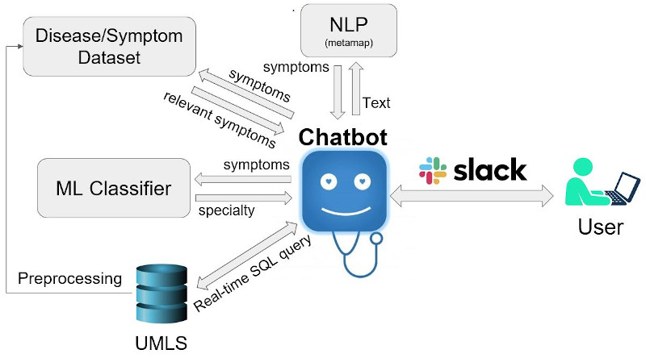
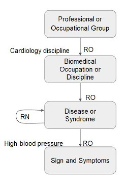

# docmatch: Slack chatbot for physician specialty recommendation from patient symptoms
Many insurance plans (PPO and EPO) do not require referral from PCP. According to American Board of Medical Specialties, there are more than 150 medical specialties and subspecialties. Therefore, in order to save money and time, it is important to find which specialty is best suited for treating your specific set of symptoms. The goal of this project is to build a chatbot for prediction of physician specialty type from symptoms and ultimately refer the user to a local physician. This is a demonstration project and there can be lots of improvements to this repo.

Here is the outline of how docmatch works:

For creating docmatch:

1) Install Unified Medical Language System (UMLS) and MySQL: 

I used Unified Medical Language System (UMLS), which is a set of unified vocabulary for medical terms. You need to install UMLS from  https://www.nlm.nih.gov/research/umls/licensedcontent/umlsknowledgesources.html. Downloading UMLS requires a license, which is free for academic use but it still needs to be approved. After downloading the UMLS database, I built a local MySQL database in order to use the data more efficiently. This step can be found in mysql_UMLS folder.

2) Process UMLS to find a mapping between symptoms and physician specialties: 

In UMLS database, there is no direct relation between specialist and symptoms. We need to parse the database and find a path between the two concepts as shown in the figure below.
The code for this step can be found in model/UMLS_analysis.ipynb.

3) Train a model: 

I trained a model on the data extracted in step 2, using logistic regression. The code for this step can be found in model/UMLS_specialist.ipynb

4) Create a chatbot: 

Docmatch chatbot asks users to describe their signs and symptoms in sentences. Sign and symptoms are extracted from user's input using Metamap(https://metamap.nlm.nih.gov/Installation.shtml). Then the chatbot suggests more symptoms that are related to the user's symptoms and asks for user confirmation. Then, chatbot runs the predictive model that was created in step 3 and provides the predicted specialty. The code for this step can be found in chatbot directory.
